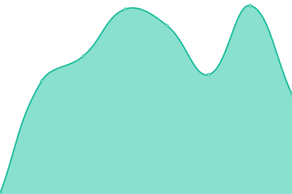

# [📈 Live Status](https://demo.upptime.js.org): <!--live status--> **🟩 All systems operational**

This repository contains the open-source uptime monitor and status page for [Peter van Doorn](petervandoorn.com), powered by [Upptime](https://github.com/upptime/upptime).

With [Upptime](https://upptime.js.org), you can get your own unlimited and free uptime monitor and status page, powered entirely by a GitHub repository. We use [Issues](https://github.com/two-trick-pony-NL/upptime/issues) as incident reports, [Actions](https://github.com/two-trick-pony-NL/upptime/actions) as uptime monitors, and [Pages](https://demo.upptime.js.org) for the status page.

<!--start: status pages-->
<!-- This summary is generated by Upptime (https://github.com/upptime/upptime) -->
<!-- Do not edit this manually, your changes will be overwritten -->
<!-- prettier-ignore -->
| URL | Status | History | Response Time | Uptime |
| --- | ------ | ------- | ------------- | ------ |
|  [petervandoorn.com](https://petervandoorn.com) | 🟩 Up | [petervandoorn-com.yml](https://github.com/two-trick-pony-NL/upptime/commits/HEAD/history/petervandoorn-com.yml) | 

 697ms
     
 | 

<a href="https://upptime.petervandoorn.com/history/petervandoorn-com">100.00%</a>
    

|  [Corina Horstman](https://corinahorstman.nl) | 🟩 Up | [corina-horstman.yml](https://github.com/two-trick-pony-NL/upptime/commits/HEAD/history/corina-horstman.yml) | 

 2423ms
     
 | 

<a href="https://upptime.petervandoorn.com/history/corina-horstman">99.75%</a>
    

|  [Mapmaker [prod]](https://mapmaker.nl/api/v1) | 🟩 Up | [mapmaker-prod.yml](https://github.com/two-trick-pony-NL/upptime/commits/HEAD/history/mapmaker-prod.yml) | 

 702ms
     
 | 

<a href="https://upptime.petervandoorn.com/history/mapmaker-prod">100.00%</a>
    

|  [Mapmaker [dev]](https://triage.mapmaker.nl/api/v1) | 🟩 Up | [mapmaker-dev.yml](https://github.com/two-trick-pony-NL/upptime/commits/HEAD/history/mapmaker-dev.yml) | 

 710ms
     
 | 

<a href="https://upptime.petervandoorn.com/history/mapmaker-dev">100.00%</a>
    

|  [Citizen Science](https://www.petervandoorn.com/cs-nl-network/) | 🟩 Up | [citizen-science.yml](https://github.com/two-trick-pony-NL/upptime/commits/HEAD/history/citizen-science.yml) | 

 1056ms
     
 | 

<a href="https://upptime.petervandoorn.com/history/citizen-science">3.02%</a>
    

|  [Photo Scavenger](https://photoscavenger.vdotvo9a4e2a6.eu-central-1.cs.amazonlightsail.com/healthcheck) | 🟩 Up | [photo-scavenger.yml](https://github.com/two-trick-pony-NL/upptime/commits/HEAD/history/photo-scavenger.yml) | 

 577ms
     
 | 

<a href="https://upptime.petervandoorn.com/history/photo-scavenger">100.00%</a>
    

|  [Keer Zeven](https://keerzeven.nl/) | 🟩 Up | [keer-zeven.yml](https://github.com/two-trick-pony-NL/upptime/commits/HEAD/history/keer-zeven.yml) | 

 1153ms
     
 | 

<a href="https://upptime.petervandoorn.com/history/keer-zeven">100.00%</a>
    

|  [bunq](https://bunq.com/) | 🟩 Up | [bunq.yml](https://github.com/two-trick-pony-NL/upptime/commits/HEAD/history/bunq.yml) | 

 426ms
     
 | 

<a href="https://upptime.petervandoorn.com/history/bunq">100.00%</a>
    

|  [slack](https://status.slack.com/api/v2.0.0/current) | 🟩 Up | [slack.yml](https://github.com/two-trick-pony-NL/upptime/commits/HEAD/history/slack.yml) | 

 38ms
     
 | 

<a href="https://upptime.petervandoorn.com/history/slack">100.00%</a>
    

<!--end: status pages-->

[**Visit our status website →**](https://demo.upptime.js.org)

## 📄 License

- Powered by: [Upptime](https://github.com/upptime/upptime)
- Code: [MIT](./LICENSE) © [Peter van Doorn](petervandoorn.com)
- Data in the `./history` directory: [Open Database License](https://opendatacommons.org/licenses/odbl/1-0/)
